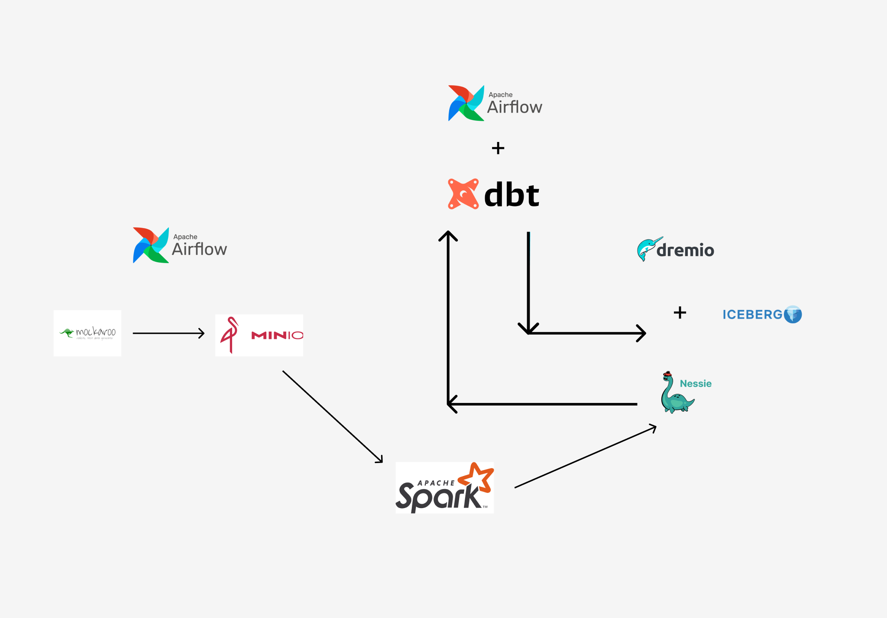

# bi-modeling-dremio

Ce projet a pour but d'implementer un processus d'automatisation du traitement de données. Voici un apercu de l'architecture globale  

  

## 1. Prérequis
- python 3.12
- Spark 3.5.1
- Airflow 2.9.2

## 2. Installation
- Cloner le projet
- Installer les dépendances
```bash
pip install dbt-core dbt-dremio
```
- Créer le repertoire config dans le repertoire source du projet, et dans ce repertoire créer le fichier .env en specifiant les elements suivants :  

```bash
MOKAROO_API_KEY=<YOUR_MOKAROO_API_KEY>

# Connection à Minio
MINIO_ENDPOINT=<MINIO_ENDPOINT>
MINIO_ACCESS_KEY=<MINIO_ACCESS_KEY>
MINIO_SECRET_KEY=<MINIO_SECRET_KEY>
MINIO_BUCKET=<MINIO_BUCKET>

# Connection à Nessie
NESSIE_CATALOG_NAME=<NESSIE_CATALOG_NAME>
NESSIE_BRANCH_NAME=<NESSIE_BRANCH_NAME>
NESSIE_NAMESPACE=<NESSIE_NAMESPACE>
NESSIE_URL=<NESSIE_URL>
NESSIE_WAREHOUSE=<NESSIE_WAREHOUSE>

DBT_DREMIO_DIR=<CHEMIN VERS LE REPERTOIRE OU SE TROUVE LA PARTIE DBT DU PROJET>
PROJECT_ROOT_DIR=<CHEMIN VERS LE REPERTOIRE DU PROJET GLOBAL>
```
- créer le fichier profiles.yml dans le repertoire .dbt, en specifiant les éléments de connexion à dremio. Dans notre cas le profil de dremio doit avoir pour nom bi_modeling_dremio (le meme que dans le fichier dbt_projetc.yml) 
```bash

## 3. Utilisation
Une fois les prérequis installés et le fichier .env configuré, vous pouvez lancer le projet en executant les différents composants du projet.  

- pour tester l'envoi des fichiers vers Minio, vous pouvez executer le script load_sales_data_into_minio.py
```bash
python load_sales_data_into_minio.py
```
- pour tester l'ecriture des données dans nessie, vous pouvez executer le script minio_to_nessie.py
```bash
python minio_to_nessie.py
```
- pour tester la transformation des données avec dbt, vous devez d'abord aller dans le repertoire du projet dbt puis lancer les commandes dbt classiques
```bash
cd dbt/bi_modeling_dremio
dbt (run|test|source freshness|seed|...)
```
- pour tester le tout avec airflow, vous devez dans un premier temps modifier les chemins (DBT_DREMIO_DIR et PROJECT_ROOT_DIR) dans les fichiers situées dans le repertoire airflow du projet, ensuite copier les fichiers dans le repertoire airflow/dags crée lors de l'installation de airflow
```bash
cp airflow/*.py <CHEMIN VERS LE REPERTOIRE AIRFLOW>/dags
```